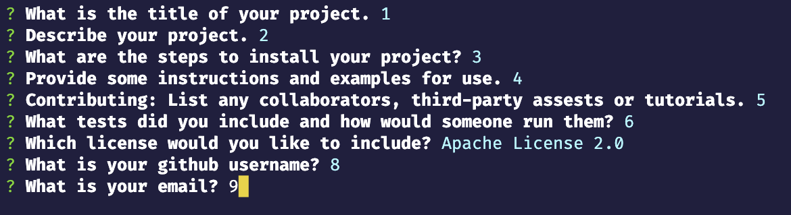
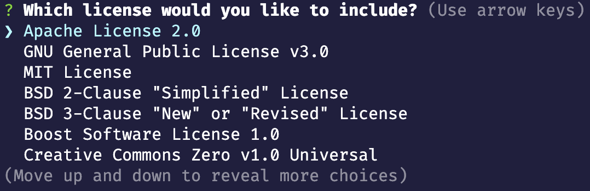

  # README generator

  ## Description
  
This application uses NODE.js and inquirer(npm) to create a REAME.md through command line prompts.
  
  ## Table of Content
  
  - [Installation](#installation)
  - [Usage](#usage)
  - [License](#license)
  - [Questions](#questions)
  
  ## Installation
  The README generator requires the installation of node.js and inquirer.

Dependencies:

    inquirer@8.2.4
  
  ## Usage
  
    

  
  ## License
  
  This application is covered under the MIT License.
  
  
  ## Questions
  
  
  [Github](www.github.com/tdavids215)
  
  e-mail: (tdavids215@gmail.com)